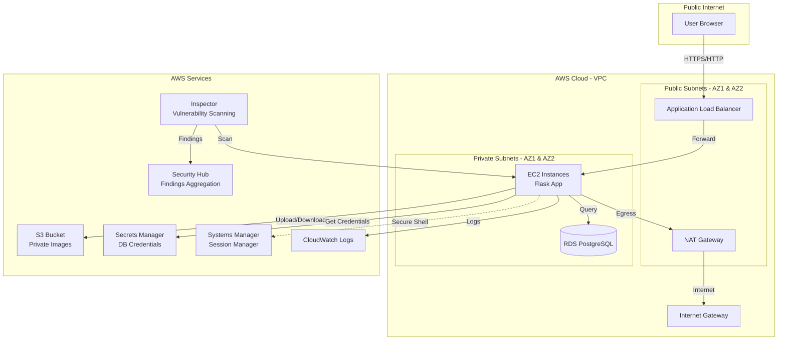
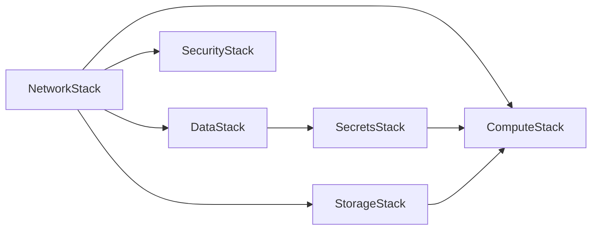

# Design Document: HR Employee Profile Manager Lab

## Overview

The HR Employee Profile Manager Lab is a comprehensive AWS training environment that demonstrates secure, production-grade infrastructure patterns using Infrastructure as Code (IaC). The system deploys a multi-tier web application with secure networking, private compute resources, application-managed authentication, encrypted data storage, and integrated security monitoring.

The architecture follows AWS Well-Architected Framework principles with emphasis on security, reliability, and cost optimization. The lab is designed to support multiple parallel team deployments through parameterized infrastructure and consistent resource tagging.

### Key Design Principles

1. **Security by Default**: All resources are private by default, with public access only where explicitly required (ALB)
2. **Least Privilege**: IAM roles grant only the minimum permissions needed for each component
3. **Infrastructure as Code**: All infrastructure is defined in CDK Python for reproducibility and version control
4. **Secrets Management**: No credentials in code; all secrets managed by AWS Secrets Manager with rotation
5. **Defense in Depth**: Multiple security layers including network isolation, security groups, encryption, and monitoring
6. **Cost Optimization**: Configurable resource sizing with sensible defaults for training environments

## Architecture

### High-Level Architecture



### Network Architecture

**VPC Design:**
- CIDR: 10.0.0.0/16 (65,536 IPs)
- Spans 2 Availability Zones for high availability
- Public subnets: 10.0.1.0/24, 10.0.2.0/24 (512 IPs total)
- Private subnets: 10.0.11.0/24, 10.0.12.0/24 (512 IPs total)

**Routing:**
- Public subnets route 0.0.0.0/0 → Internet Gateway
- Private subnets route 0.0.0.0/0 → NAT Gateway (in AZ1 by default)
- NAT Gateway provides outbound internet for package updates and AWS API calls

**NAT Gateway Strategy:**
- Default: Single NAT Gateway in AZ1 (cost optimization for training)
- Optional: Dual NAT Gateways (one per AZ) for production-like high availability
- Configurable via `nat_mode` parameter

### Security Architecture

**Network Segmentation:**
```
Internet → ALB (Public) → EC2 (Private) → RDS (Private)
                       ↓
                    S3 (Private)
```

**Security Groups:**

1. **ALB Security Group** (`hrapp-{id}-alb-sg`)
   - Inbound: TCP 80 from `allowed_ingress_cidr` (default: 0.0.0.0/0)
   - Inbound: TCP 443 from `allowed_ingress_cidr` (for future TLS)
   - Outbound: TCP 5000 to EC2 security group

2. **EC2 Security Group** (`hrapp-{id}-ec2-sg`)
   - Inbound: TCP 5000 from ALB security group only
   - Outbound: TCP 5432 to RDS security group
   - Outbound: TCP 443 to 0.0.0.0/0 (AWS APIs, S3, Secrets Manager)
   - Outbound: TCP 80 to 0.0.0.0/0 (package repositories)

3. **RDS Security Group** (`hrapp-{id}-rds-sg`)
   - Inbound: TCP 5432 from EC2 security group only
   - No outbound rules needed (stateful)

**IAM Security:**
- EC2 instance profile with least-privilege role
- No long-term credentials stored on instances
- Secrets Manager for database credentials only
- Session Manager for secure access (no SSH keys)

## Components and Interfaces

### CDK Stack Architecture

The infrastructure is organized into six independent CDK stacks with clear dependencies:



**Stack Dependency Order:**
1. **NetworkStack** - VPC, subnets, routing (no dependencies)
2. **SecurityStack** - Inspector, Security Hub (no dependencies)
3. **StorageStack** - S3 bucket (depends on NetworkStack for VPC endpoints if added)
4. **DataStack** - RDS instance (depends on NetworkStack)
5. **SecretsStack** - Secrets Manager secret with rotation (depends on DataStack)
6. **ComputeStack** - EC2, ALB, IAM roles (depends on NetworkStack, DataStack, SecretsStack, StorageStack)

### Stack 1: NetworkStack

**Purpose:** Foundational networking infrastructure

**Resources:**
- VPC with DNS support enabled
- 2 public subnets (one per AZ)
- 2 private subnets (one per AZ)
- Internet Gateway attached to VPC
- 1 or 2 NAT Gateways (based on `nat_mode` parameter)
- Elastic IPs for NAT Gateways
- Route tables for public and private subnets
- Security groups for ALB, EC2, and RDS

**Outputs:**
- VPC ID
- Public subnet IDs
- Private subnet IDs
- Security group IDs
- Availability zones

**Configuration Parameters:**
- `nat_mode`: "single" (default) or "dual"
- `allowed_ingress_cidr`: CIDR for ALB access (default: "0.0.0.0/0")

### Stack 2: SecurityStack

**Purpose:** Enable security monitoring and vulnerability detection

**Resources:**
- Inspector2 enablement for EC2 scanning
- Security Hub enablement
- Inspector → Security Hub integration

**Configuration:**
- Inspector scans: EC2 package vulnerabilities, network reachability
- Security Hub standards: AWS Foundational Security Best Practices

**Outputs:**
- Inspector ARN
- Security Hub ARN

### Stack 3: StorageStack

**Purpose:** Private object storage for employee profile images

**Resources:**
- S3 bucket: `hrapp-{deployment_id}-uploads-{account_id}`
- Bucket encryption: AES256 (SSE-S3)
- Versioning: Enabled
- Public access block: All blocked
- Lifecycle policy: Optional (can add for cost optimization)

**Bucket Policy:**
- Deny all public access
- Allow EC2 role to PutObject/GetObject under `uploads/*` prefix only

**Outputs:**
- Bucket name
- Bucket ARN

### Stack 4: DataStack

**Purpose:** Private relational database for application data

**Resources:**
- RDS PostgreSQL instance (version 15.x)
- DB subnet group spanning private subnets
- Parameter group with secure defaults
- Option group (if needed)

**Configuration:**
- Instance class: db.t3.micro (default, configurable)
- Storage: 20 GB GP3 (configurable)
- Multi-AZ: Configurable via `db_multi_az` parameter (default: false)
- Backup retention: 7 days
- Encryption: Enabled with AWS managed key
- Publicly accessible: False
- Deletion protection: True (for production)

**Database Initialization:**
- Master username: Generated and stored in Secrets Manager
- Master password: Generated and stored in Secrets Manager
- Initial database: `hrappdb`

**Outputs:**
- RDS endpoint
- RDS port
- Database name
- Secret ARN (for SecretsStack)

### Stack 5: SecretsStack

**Purpose:** Secure credential management with automatic rotation

**Resources:**
- Secrets Manager secret containing:
  - `username`: RDS master username
  - `password`: RDS master password
  - `engine`: "postgres"
  - `host`: RDS endpoint
  - `port`: 5432
  - `dbname`: "hrappdb"
- Rotation Lambda function (managed by RDS)
- Rotation schedule: 30 days

**Rotation Configuration:**
- Rotation strategy: Single-user rotation (master user rotates its own password)
- RDS manages rotation Lambda automatically
- Application must handle rotation gracefully

**Outputs:**
- Secret ARN
- Secret name

### Stack 6: ComputeStack

**Purpose:** Application hosting and load balancing

**Resources:**

**IAM Role:**
- Role name: `hrapp-{deployment_id}-ec2-role`
- Managed policies:
  - `AmazonSSMManagedInstanceCore` (Session Manager)
- Inline policies:
  - Read secret from Secrets Manager
  - PutObject/GetObject to S3 bucket under `uploads/*`
  - PutLogEvents to CloudWatch Logs

**EC2 Launch Template:**
- AMI: Amazon Linux 2023 (latest)
- Instance type: t3.micro (default, configurable)
- IMDSv2: Required (enforced)
- User data script:
  - Install Python 3.11, pip, PostgreSQL client
  - Install application dependencies (Flask, psycopg2, boto3, bcrypt)
  - Create application directory `/opt/hrapp`
  - Copy application code
  - Create systemd service unit
  - Enable and start service

**Auto Scaling Group:**
- Desired capacity: 2 (default)
- Min: 1, Max: 4
- Health check type: ELB
- Health check grace period: 300 seconds
- Subnets: Private subnets

**Application Load Balancer:**
- Scheme: Internet-facing
- Subnets: Public subnets
- Security group: ALB security group
- Listener: Port 80 (HTTP)
- Target group:
  - Protocol: HTTP
  - Port: 5000
  - Health check path: `/health`
  - Health check interval: 30 seconds
  - Healthy threshold: 2
  - Unhealthy threshold: 3
  - Timeout: 5 seconds

**Outputs:**
- ALB DNS name
- EC2 instance IDs
- IAM role ARN

### Application Component

**Technology Stack:**
- Framework: Flask (Python 3.11)
- Database driver: psycopg2-binary
- Password hashing: bcrypt
- AWS SDK: boto3
- Session management: Flask sessions with server-side storage

**Application Structure:**
```
/opt/hrapp/
├── app.py              # Main Flask application
├── db.py               # Database connection and queries
├── auth.py             # Authentication logic
├── config.py           # Configuration from environment
├── requirements.txt    # Python dependencies
└── static/             # Static files (minimal)
```

**Environment Variables:**
```bash
APP_PORT=5000
SECRET_KEY=<generated-random-key>
DB_SECRET_ARN=<secrets-manager-arn>
S3_BUCKET_NAME=<bucket-name>
DEPLOYMENT_ID=<deployment-id>
AWS_REGION=<region>
```

**Application Endpoints:**

1. **GET /health**
   - Purpose: ALB health checks
   - Returns: 200 OK if database is reachable, 503 otherwise
   - Authentication: None

2. **POST /register**
   - Purpose: User registration
   - Input: JSON with `username`, `password`
   - Process: Hash password with bcrypt, insert into users table
   - Returns: 201 Created with user ID, or 400 if username exists

3. **POST /login**
   - Purpose: User authentication
   - Input: JSON with `username`, `password`
   - Process: Verify password against bcrypt hash, create session
   - Returns: 200 OK with session cookie, or 401 Unauthorized

4. **POST /logout**
   - Purpose: End user session
   - Authentication: Required
   - Process: Clear session
   - Returns: 200 OK

5. **POST /employees**
   - Purpose: Create employee profile
   - Authentication: Required
   - Input: Multipart form with `name`, `role`, `department`, `image` file
   - Process:
     - Generate UUID for image filename
     - Upload image to S3: `uploads/{deployment_id}/{uuid}.{ext}`
     - Insert metadata into employees table
   - Returns: 201 Created with employee ID

6. **GET /employees**
   - Purpose: List employee profiles
   - Authentication: Required
   - Returns: JSON array of employee objects

7. **GET /employees/{id}**
   - Purpose: Get specific employee profile
   - Authentication: Required
   - Returns: JSON employee object with presigned S3 URL for image

**Database Connection Management:**

```python
class DatabaseConnection:
    def __init__(self):
        self.connection = None
        self.secret_cache = None
        self.secret_cache_time = None
        
    def get_secret(self, force_refresh=False):
        # Cache secret for 5 minutes
        if force_refresh or not self.secret_cache or \
           (time.time() - self.secret_cache_time) > 300:
            client = boto3.client('secretsmanager')
            response = client.get_secret_value(SecretId=os.environ['DB_SECRET_ARN'])
            self.secret_cache = json.loads(response['SecretString'])
            self.secret_cache_time = time.time()
        return self.secret_cache
    
    def connect(self, retry_on_auth_failure=True):
        try:
            secret = self.get_secret()
            self.connection = psycopg2.connect(
                host=secret['host'],
                port=secret['port'],
                database=secret['dbname'],
                user=secret['username'],
                password=secret['password']
            )
        except psycopg2.OperationalError as e:
            if 'authentication failed' in str(e) and retry_on_auth_failure:
                # Credential rotation may have occurred
                secret = self.get_secret(force_refresh=True)
                self.connection = psycopg2.connect(
                    host=secret['host'],
                    port=secret['port'],
                    database=secret['dbname'],
                    user=secret['username'],
                    password=secret['password']
                )
            else:
                raise
```

**Systemd Service Unit:**

```ini
[Unit]
Description=HR Employee Profile Manager Application
After=network.target

[Service]
Type=simple
User=ec2-user
WorkingDirectory=/opt/hrapp
Environment="APP_PORT=5000"
Environment="SECRET_KEY=<generated>"
Environment="DB_SECRET_ARN=<arn>"
Environment="S3_BUCKET_NAME=<bucket>"
Environment="DEPLOYMENT_ID=<id>"
Environment="AWS_REGION=<region>"
ExecStart=/usr/bin/python3 /opt/hrapp/app.py
Restart=always
RestartSec=10

[Install]
WantedBy=multi-user.target
```

## Data Models

### Database Schema

**users table:**
```sql
CREATE TABLE users (
    id SERIAL PRIMARY KEY,
    username VARCHAR(255) UNIQUE NOT NULL,
    password_hash VARCHAR(255) NOT NULL,
    created_at TIMESTAMP DEFAULT CURRENT_TIMESTAMP,
    CONSTRAINT username_length CHECK (LENGTH(username) >= 3)
);

CREATE INDEX idx_users_username ON users(username);
```

**employees table:**
```sql
CREATE TABLE employees (
    id SERIAL PRIMARY KEY,
    name VARCHAR(255) NOT NULL,
    role VARCHAR(255) NOT NULL,
    department VARCHAR(255) NOT NULL,
    image_s3_key VARCHAR(512),
    image_url VARCHAR(1024),
    user_id INTEGER NOT NULL,
    created_at TIMESTAMP DEFAULT CURRENT_TIMESTAMP,
    updated_at TIMESTAMP DEFAULT CURRENT_TIMESTAMP,
    CONSTRAINT fk_user FOREIGN KEY (user_id) REFERENCES users(id) ON DELETE CASCADE,
    CONSTRAINT name_not_empty CHECK (LENGTH(name) > 0)
);

CREATE INDEX idx_employees_user_id ON employees(user_id);
CREATE INDEX idx_employees_department ON employees(department);
```

**sessions table (optional, for server-side sessions):**
```sql
CREATE TABLE sessions (
    id VARCHAR(255) PRIMARY KEY,
    user_id INTEGER NOT NULL,
    data TEXT,
    expires_at TIMESTAMP NOT NULL,
    CONSTRAINT fk_session_user FOREIGN KEY (user_id) REFERENCES users(id) ON DELETE CASCADE
);

CREATE INDEX idx_sessions_expires ON sessions(expires_at);
CREATE INDEX idx_sessions_user_id ON sessions(user_id);
```

### S3 Object Structure

**Key Pattern:**
```
uploads/{deployment_id}/{uuid}.{extension}
```

**Example:**
```
uploads/team01/a1b2c3d4-e5f6-7890-abcd-ef1234567890.jpg
uploads/team01/b2c3d4e5-f6a7-8901-bcde-f12345678901.png
```

**Metadata:**
- Content-Type: image/jpeg, image/png, image/gif
- Server-side encryption: AES256
- Storage class: STANDARD (can optimize with lifecycle policies)

### Configuration Data Model

**CDK Context (cdk.json):**
```json
{
  "app": "python3 app.py",
  "context": {
    "deployment_id": "team01",
    "owner": "training-admin",
    "allowed_ingress_cidr": "0.0.0.0/0",
    "nat_mode": "single",
    "db_multi_az": false,
    "ec2_instance_type": "t3.micro",
    "db_instance_class": "db.t3.micro"
  }
}
```

**Environment Variables (EC2):**
- `APP_PORT`: Application listening port (5000)
- `SECRET_KEY`: Flask session secret (generated)
- `DB_SECRET_ARN`: Secrets Manager ARN for database credentials
- `S3_BUCKET_NAME`: S3 bucket name for uploads
- `DEPLOYMENT_ID`: Deployment identifier
- `AWS_REGION`: AWS region
- `LOG_LEVEL`: Application log level (INFO)

## Correctness Properties

*A property is a characteristic or behavior that should hold true across all valid executions of a system—essentially, a formal statement about what the system should do. Properties serve as the bridge between human-readable specifications and machine-verifiable correctness guarantees.*

### Infrastructure Properties

**Property 1: Resource Metadata Consistency**
*For any* deployment with a given Deployment_ID and Owner, all created AWS resources SHALL have consistent tags (Project=HRAppLab, DeploymentID=<id>, Owner=<owner>) and follow the naming convention hrapp-<deploymentid>-<resource>.
**Validates: Requirements 1.4, 1.5**

**Property 2: Deployment Isolation**
*For any* two deployments with different Deployment_ID values, the created resources SHALL NOT conflict or interfere with each other, and each deployment SHALL operate independently.
**Validates: Requirements 1.3, 18.5**

**Property 3: Password Hash Security**
*For any* user registration or password storage operation, the password SHALL be hashed using bcrypt before storage, and the stored value SHALL match the bcrypt hash format pattern.
**Validates: Requirements 5.3, 11.2**

**Property 4: Authentication Verification**
*For any* login attempt, the application SHALL verify the provided password against the stored bcrypt hash, returning success only when the password matches and failure otherwise.
**Validates: Requirements 11.4**

**Property 5: Authenticated Endpoint Protection**
*For any* protected endpoint (employee creation, employee retrieval), unauthenticated requests SHALL be rejected with appropriate HTTP status codes.
**Validates: Requirements 12.2**

### Data Consistency Properties

**Property 6: Image Upload Consistency**
*For any* employee profile creation with an image upload, the system SHALL store the image in S3 under the path pattern uploads/<deploymentid>/<uuid>.<extension>, store the S3 key in the employees table, and associate the employee with the authenticated user.
**Validates: Requirements 12.4, 12.5, 12.6**

### Resilience Properties

**Property 7: Credential Rotation Resilience**
*For any* database authentication failure, the application SHALL re-fetch credentials from Secrets Manager, retry the failed operation, and continue operating without becoming unavailable.
**Validates: Requirements 6.7, 14.2, 14.3, 14.5**

### Infrastructure Validation (Examples and Edge Cases)

The following are specific infrastructure configurations that must be validated but don't require property-based testing across random inputs:

**Validation 1: VPC Network Architecture**
- VPC spans exactly 2 availability zones
- Public subnets exist in each AZ with IGW routing
- Private subnets exist in each AZ with NAT routing
- Security groups enforce ALB→EC2→RDS traffic flow only
**Validates: Requirements 2.1, 2.2, 2.3, 2.4, 2.7, 2.8, 3.1, 3.2, 3.3**

**Validation 2: NAT Gateway Configuration**
- When nat_mode="single": exactly 1 NAT Gateway exists
- When nat_mode="dual": exactly 2 NAT Gateways exist (one per AZ)
**Validates: Requirements 2.5, 2.6**

**Validation 3: RDS Configuration**
- RDS instance exists in private subnets
- Publicly accessible = false
- Encryption at rest enabled
- Automated backups enabled
- Multi-AZ matches db_multi_az parameter
**Validates: Requirements 4.1, 4.2, 4.3, 4.4, 4.5, 4.6**

**Validation 4: S3 Bucket Security**
- Bucket name follows hrapp-<deploymentid>-uploads pattern
- All public access blocked
- Server-side encryption enabled
- Versioning enabled
- No public read access in bucket policy
**Validates: Requirements 7.1, 7.2, 7.3, 7.4, 7.7**

**Validation 5: IAM Least Privilege**
- EC2 role includes AmazonSSMManagedInstanceCore
- EC2 role can read specific Secrets Manager secret only
- EC2 role can PutObject/GetObject to S3 under uploads/* only
- EC2 role can write to CloudWatch Logs
- EC2 role does NOT have admin or power user policies
**Validates: Requirements 8.1, 8.2, 8.3, 8.4, 8.5, 8.6**

**Validation 6: EC2 Security Configuration**
- Instances launched in private subnets
- IMDSv2 required
- IAM role attached
- No public IP addresses
- No SSH ingress rules in security group
**Validates: Requirements 9.1, 9.2, 9.3, 9.5, 3.6**

**Validation 7: ALB Configuration**
- ALB in public subnets across multiple AZs
- Listener on port 80
- Target group points to EC2 instances
- Health check path = /health
- Health check protocol = HTTP
**Validates: Requirements 10.1, 10.2, 10.3, 10.4, 10.5**

**Validation 8: Application Endpoints**
- /health endpoint exists and returns 200 when healthy
- /health returns 503 when database unreachable
- /register endpoint exists
- /login endpoint exists
- /employees POST endpoint exists
- /employees GET endpoint exists
**Validates: Requirements 11.1, 11.3, 12.1, 12.7, 13.1, 13.2, 13.4**

**Validation 9: Session Cookie Security**
- Session cookies have HttpOnly flag
- Session cookies have SameSite=Lax
- Session cookies have Secure flag when TLS enabled
**Validates: Requirements 11.6, 11.7, 11.8**

**Validation 10: Database Schema**
- users table exists with columns: id, username, password_hash, created_at
- employees table exists with columns: id, name, role, department, image_s3_key, image_url, user_id, created_at, updated_at
- Foreign key constraint exists from employees.user_id to users.id
**Validates: Requirements 5.1, 5.2, 5.4**

**Validation 11: Secrets Manager Configuration**
- Secret exists containing RDS credentials
- Automatic rotation enabled
- Rotation schedule = 30 days
- RDS uses secret for master credentials
**Validates: Requirements 6.1, 6.2, 6.3, 6.4**

**Validation 12: Security Monitoring**
- Inspector enabled for account
- Inspector EC2 scanning enabled
- Security Hub enabled
- Inspector findings published to Security Hub
**Validates: Requirements 15.1, 15.2, 15.5, 16.1, 16.2**

**Validation 13: Vulnerability Detection Workflow**
- Script exists to install outdated package
- Inspector detects vulnerability after installation
- Finding appears in Security Hub
- Remediation script exists
**Validates: Requirements 17.1, 17.2, 17.3, 17.5**

**Validation 14: Systemd Service Configuration**
- Service unit file created by user data
- Service starts on boot
- Service restarts on failure
- Environment variables configured
- Application runs on APP_PORT
**Validates: Requirements 19.1, 19.2, 19.3, 19.4, 19.5**


## Error Handling

### Infrastructure Deployment Errors

**CDK Synthesis Errors:**
- Validation: CDK validates all constructs before synthesis
- Error messages: Clear indication of misconfigured resources
- Resolution: Fix construct configuration and re-synthesize

**CloudFormation Deployment Errors:**
- Rollback: Automatic rollback on stack creation failure
- Change sets: Preview changes before applying updates
- Dependency errors: CDK handles dependencies automatically
- Resource limits: Check account limits before deployment

**Common Deployment Issues:**

1. **Insufficient IAM Permissions**
   - Error: User deploying CDK lacks permissions
   - Resolution: Ensure deploying user has CloudFormation, EC2, RDS, S3, IAM permissions

2. **Resource Name Conflicts**
   - Error: Resource with same name already exists
   - Resolution: Use unique Deployment_ID for each team

3. **Availability Zone Capacity**
   - Error: Requested instance type unavailable in AZ
   - Resolution: CDK will retry in different AZ or use different instance type

4. **RDS Snapshot Restore**
   - Error: Snapshot not found or incompatible
   - Resolution: Verify snapshot ID and region

### Application Runtime Errors

**Database Connection Errors:**
```python
try:
    db.connect()
except psycopg2.OperationalError as e:
    if 'authentication failed' in str(e):
        # Credential rotation - refresh and retry
        db.connect(retry_on_auth_failure=True)
    elif 'could not connect' in str(e):
        # Network or RDS unavailable
        logger.error("Database unreachable", exc_info=True)
        return {"error": "Service temporarily unavailable"}, 503
    else:
        raise
```

**S3 Upload Errors:**
```python
try:
    s3_client.put_object(Bucket=bucket, Key=key, Body=file_data)
except ClientError as e:
    error_code = e.response['Error']['Code']
    if error_code == 'AccessDenied':
        logger.error("S3 access denied - check IAM permissions")
        return {"error": "Upload failed"}, 500
    elif error_code == 'NoSuchBucket':
        logger.error("S3 bucket not found")
        return {"error": "Storage unavailable"}, 500
    else:
        raise
```

**Secrets Manager Errors:**
```python
try:
    secret = sm_client.get_secret_value(SecretId=secret_arn)
except ClientError as e:
    error_code = e.response['Error']['Code']
    if error_code == 'ResourceNotFoundException':
        logger.error("Secret not found - check ARN")
        raise
    elif error_code == 'AccessDeniedException':
        logger.error("Access denied to secret - check IAM role")
        raise
    else:
        raise
```

**Authentication Errors:**
- Invalid credentials: Return 401 Unauthorized
- Missing session: Return 401 Unauthorized
- Expired session: Clear session, return 401
- Bcrypt errors: Log error, return 500

**Validation Errors:**
- Missing required fields: Return 400 Bad Request with field list
- Invalid file type: Return 400 with supported types
- File too large: Return 413 Payload Too Large
- Invalid username format: Return 400 with requirements

### Health Check Error Handling

The `/health` endpoint performs comprehensive health checks:

```python
@app.route('/health')
def health_check():
    try:
        # Check database connectivity
        conn = db.get_connection()
        cursor = conn.cursor()
        cursor.execute('SELECT 1')
        cursor.close()
        
        return {"status": "healthy", "database": "connected"}, 200
    except Exception as e:
        logger.error("Health check failed", exc_info=True)
        return {"status": "unhealthy", "error": str(e)}, 503
```

### Credential Rotation Error Handling

The application handles Secrets Manager rotation gracefully:

1. **Normal Operation**: Credentials cached for 5 minutes
2. **Auth Failure Detected**: Refresh credentials from Secrets Manager
3. **Retry Operation**: Attempt database operation with new credentials
4. **Log Event**: Record rotation event for monitoring
5. **Continue Service**: No downtime during rotation

### Security Error Handling

**Inspector Scan Failures:**
- Automatic retry by Inspector service
- Findings delayed but not lost
- Check Inspector console for scan status

**Security Hub Integration Failures:**
- Inspector findings queued for delivery
- Eventual consistency - findings appear within minutes
- Check Security Hub console for integration status

## Testing Strategy

### Overview

The HR Employee Profile Manager Lab requires a comprehensive testing strategy that validates both infrastructure correctness and application functionality. Testing is divided into three categories:

1. **Infrastructure Tests**: Validate CDK synthesis and deployed AWS resources
2. **Application Unit Tests**: Validate individual application components
3. **Application Property Tests**: Validate universal properties across all inputs
4. **Integration Tests**: Validate end-to-end workflows

### Infrastructure Testing

**CDK Snapshot Tests:**
```python
# tests/unit/test_network_stack.py
import aws_cdk as cdk
from aws_cdk.assertions import Template
from infra.stacks.network_stack import NetworkStack

def test_network_stack_snapshot():
    app = cdk.App()
    stack = NetworkStack(app, "TestStack", 
                         deployment_id="test01",
                         nat_mode="single")
    template = Template.from_stack(stack)
    
    # Verify VPC created
    template.resource_count_is("AWS::EC2::VPC", 1)
    
    # Verify subnets
    template.resource_count_is("AWS::EC2::Subnet", 4)  # 2 public + 2 private
    
    # Verify NAT Gateway count
    template.resource_count_is("AWS::EC2::NatGateway", 1)
    
    # Verify security groups
    template.resource_count_is("AWS::EC2::SecurityGroup", 3)
```

**Resource Validation Tests:**
```python
# tests/integration/test_deployed_resources.py
import boto3
import pytest

def test_vpc_configuration(deployment_id):
    ec2 = boto3.client('ec2')
    
    # Find VPC by tag
    vpcs = ec2.describe_vpcs(
        Filters=[
            {'Name': 'tag:DeploymentID', 'Values': [deployment_id]},
            {'Name': 'tag:Project', 'Values': ['HRAppLab']}
        ]
    )
    
    assert len(vpcs['Vpcs']) == 1
    vpc = vpcs['Vpcs'][0]
    
    # Verify CIDR
    assert vpc['CidrBlock'] == '10.0.0.0/16'
    
    # Verify DNS support
    assert vpc['EnableDnsSupport'] == True
    assert vpc['EnableDnsHostnames'] == True
```

### Application Unit Testing

**Authentication Tests:**
```python
# tests/unit/test_auth.py
import pytest
from app.auth import hash_password, verify_password

def test_password_hashing():
    password = "SecurePassword123!"
    hashed = hash_password(password)
    
    # Verify bcrypt format
    assert hashed.startswith('$2b$')
    
    # Verify verification works
    assert verify_password(password, hashed) == True
    assert verify_password("WrongPassword", hashed) == False

def test_empty_password():
    with pytest.raises(ValueError):
        hash_password("")

def test_password_verification_with_invalid_hash():
    assert verify_password("password", "invalid_hash") == False
```

**Database Tests:**
```python
# tests/unit/test_db.py
import pytest
from app.db import DatabaseConnection
from unittest.mock import Mock, patch

def test_credential_refresh_on_auth_failure():
    db = DatabaseConnection()
    
    with patch('boto3.client') as mock_boto:
        # First call fails with auth error
        # Second call succeeds after refresh
        mock_sm = Mock()
        mock_boto.return_value = mock_sm
        
        # Simulate auth failure then success
        db.connect(retry_on_auth_failure=True)
        
        # Verify secret was fetched twice
        assert mock_sm.get_secret_value.call_count == 2
```

**S3 Upload Tests:**
```python
# tests/unit/test_s3.py
import pytest
from app.storage import upload_image
from unittest.mock import Mock, patch

def test_image_upload_key_format():
    with patch('boto3.client') as mock_boto:
        mock_s3 = Mock()
        mock_boto.return_value = mock_s3
        
        deployment_id = "team01"
        file_data = b"fake image data"
        filename = "profile.jpg"
        
        key = upload_image(deployment_id, file_data, filename)
        
        # Verify key format
        assert key.startswith(f"uploads/{deployment_id}/")
        assert key.endswith(".jpg")
        
        # Verify S3 put_object called
        mock_s3.put_object.assert_called_once()
```

### Application Property-Based Testing

**Property Testing Framework:** Use `hypothesis` library for Python

**Configuration:** Minimum 100 iterations per property test

**Property Test 1: Password Hash Security**
```python
# tests/property/test_auth_properties.py
from hypothesis import given, strategies as st
from app.auth import hash_password, verify_password

@given(st.text(min_size=1, max_size=100))
def test_password_round_trip(password):
    """
    Feature: hr-profile-manager-lab, Property 3: Password Hash Security
    For any password, hashing then verifying should succeed
    """
    hashed = hash_password(password)
    assert verify_password(password, hashed) == True
    
@given(st.text(min_size=1, max_size=100), st.text(min_size=1, max_size=100))
def test_different_passwords_different_hashes(password1, password2):
    """
    Feature: hr-profile-manager-lab, Property 3: Password Hash Security
    For any two different passwords, hashes should be different
    """
    if password1 != password2:
        hash1 = hash_password(password1)
        hash2 = hash_password(password2)
        assert hash1 != hash2
```

**Property Test 2: Authentication Verification**
```python
# tests/property/test_auth_properties.py
@given(st.text(min_size=1, max_size=100), st.text(min_size=1, max_size=100))
def test_wrong_password_fails(correct_password, wrong_password):
    """
    Feature: hr-profile-manager-lab, Property 4: Authentication Verification
    For any correct password and different wrong password, verification should fail
    """
    if correct_password != wrong_password:
        hashed = hash_password(correct_password)
        assert verify_password(wrong_password, hashed) == False
```

**Property Test 3: Image Upload Consistency**
```python
# tests/property/test_storage_properties.py
from hypothesis import given, strategies as st
from app.storage import upload_image, generate_s3_key

@given(
    st.text(min_size=1, max_size=20, alphabet=st.characters(whitelist_categories=('Ll', 'Nd'))),
    st.text(min_size=1, max_size=50),
    st.sampled_from(['jpg', 'png', 'gif'])
)
def test_s3_key_format(deployment_id, filename, extension):
    """
    Feature: hr-profile-manager-lab, Property 6: Image Upload Consistency
    For any deployment ID and filename, S3 key should follow pattern
    """
    key = generate_s3_key(deployment_id, filename, extension)
    
    # Verify pattern: uploads/<deploymentid>/<uuid>.<extension>
    assert key.startswith(f"uploads/{deployment_id}/")
    assert key.endswith(f".{extension}")
    
    # Verify UUID format in middle
    parts = key.split('/')
    assert len(parts) == 3
    uuid_part = parts[2].split('.')[0]
    assert len(uuid_part) == 36  # UUID format
```

**Property Test 4: Resource Metadata Consistency**
```python
# tests/property/test_infrastructure_properties.py
from hypothesis import given, strategies as st
import boto3

@given(
    st.text(min_size=4, max_size=20, alphabet=st.characters(whitelist_categories=('Ll', 'Nd'))),
    st.text(min_size=1, max_size=50)
)
def test_resource_tagging(deployment_id, owner):
    """
    Feature: hr-profile-manager-lab, Property 1: Resource Metadata Consistency
    For any deployment, all resources should have consistent tags
    """
    # This would be run against deployed infrastructure
    ec2 = boto3.client('ec2')
    
    # Get all resources for deployment
    resources = ec2.describe_instances(
        Filters=[{'Name': 'tag:DeploymentID', 'Values': [deployment_id]}]
    )
    
    for reservation in resources['Reservations']:
        for instance in reservation['Instances']:
            tags = {tag['Key']: tag['Value'] for tag in instance.get('Tags', [])}
            
            # Verify required tags
            assert tags.get('Project') == 'HRAppLab'
            assert tags.get('DeploymentID') == deployment_id
            assert tags.get('Owner') == owner
```

**Property Test 5: Deployment Isolation**
```python
# tests/property/test_infrastructure_properties.py
@given(
    st.text(min_size=4, max_size=20, alphabet=st.characters(whitelist_categories=('Ll', 'Nd'))),
    st.text(min_size=4, max_size=20, alphabet=st.characters(whitelist_categories=('Ll', 'Nd')))
)
def test_deployment_isolation(deployment_id1, deployment_id2):
    """
    Feature: hr-profile-manager-lab, Property 2: Deployment Isolation
    For any two different deployment IDs, resources should not conflict
    """
    if deployment_id1 != deployment_id2:
        # Verify resource names don't conflict
        s3 = boto3.client('s3')
        
        bucket1 = f"hrapp-{deployment_id1}-uploads"
        bucket2 = f"hrapp-{deployment_id2}-uploads"
        
        assert bucket1 != bucket2
```

### Integration Testing

**End-to-End Workflow Tests:**
```python
# tests/integration/test_employee_workflow.py
import requests
import pytest

def test_complete_employee_creation_workflow(alb_url):
    """Test complete workflow: register → login → create employee → retrieve"""
    
    # 1. Register user
    response = requests.post(f"{alb_url}/register", json={
        "username": "testuser",
        "password": "SecurePass123!"
    })
    assert response.status_code == 201
    
    # 2. Login
    response = requests.post(f"{alb_url}/login", json={
        "username": "testuser",
        "password": "SecurePass123!"
    })
    assert response.status_code == 200
    session_cookie = response.cookies
    
    # 3. Create employee with image
    with open('tests/fixtures/profile.jpg', 'rb') as img:
        response = requests.post(
            f"{alb_url}/employees",
            files={'image': img},
            data={
                'name': 'John Doe',
                'role': 'Engineer',
                'department': 'IT'
            },
            cookies=session_cookie
        )
    assert response.status_code == 201
    employee_id = response.json()['id']
    
    # 4. Retrieve employee
    response = requests.get(
        f"{alb_url}/employees/{employee_id}",
        cookies=session_cookie
    )
    assert response.status_code == 200
    employee = response.json()
    assert employee['name'] == 'John Doe'
    assert 'image_url' in employee
```

**Health Check Tests:**
```python
# tests/integration/test_health.py
def test_health_endpoint_when_healthy(alb_url):
    response = requests.get(f"{alb_url}/health")
    assert response.status_code == 200
    assert response.json()['status'] == 'healthy'

def test_health_endpoint_when_database_down(alb_url, stop_rds):
    # Stop RDS temporarily
    stop_rds()
    
    response = requests.get(f"{alb_url}/health")
    assert response.status_code == 503
    assert response.json()['status'] == 'unhealthy'
```

### Security Testing

**Vulnerability Detection Tests:**
```python
# tests/security/test_vulnerability_detection.py
import boto3
import time

def test_inspector_detects_outdated_package(instance_id, deployment_id):
    """Test that Inspector detects intentionally installed vulnerable package"""
    
    ssm = boto3.client('ssm')
    inspector = boto3.client('inspector2')
    securityhub = boto3.client('securityhub')
    
    # 1. Install outdated package via SSM
    response = ssm.send_command(
        InstanceIds=[instance_id],
        DocumentName='AWS-RunShellScript',
        Parameters={'commands': ['sudo yum install -y openssl-1.0.1e']}
    )
    command_id = response['Command']['CommandId']
    
    # Wait for command completion
    waiter = ssm.get_waiter('command_executed')
    waiter.wait(CommandId=command_id, InstanceId=instance_id)
    
    # 2. Wait for Inspector scan (may take up to 24 hours, use shorter interval for testing)
    time.sleep(300)  # 5 minutes
    
    # 3. Check for findings in Inspector
    findings = inspector.list_findings(
        filterCriteria={
            'resourceId': [{'comparison': 'EQUALS', 'value': instance_id}]
        }
    )
    
    assert len(findings['findings']) > 0
    
    # 4. Verify finding appears in Security Hub
    sh_findings = securityhub.get_findings(
        Filters={
            'ResourceId': [{'Value': instance_id, 'Comparison': 'EQUALS'}],
            'ProductName': [{'Value': 'Inspector', 'Comparison': 'EQUALS'}]
        }
    )
    
    assert len(sh_findings['Findings']) > 0
```

### Test Execution

**Unit Tests:**
```bash
# Run all unit tests
pytest tests/unit/ -v

# Run with coverage
pytest tests/unit/ --cov=app --cov-report=html
```

**Property Tests:**
```bash
# Run property tests with 100 iterations minimum
pytest tests/property/ -v --hypothesis-show-statistics

# Run with more iterations for thorough testing
pytest tests/property/ -v --hypothesis-seed=random --hypothesis-max-examples=1000
```

**Integration Tests:**
```bash
# Run integration tests (requires deployed infrastructure)
pytest tests/integration/ -v --alb-url=<alb-dns-name>
```

**Infrastructure Tests:**
```bash
# Run CDK tests
pytest tests/infrastructure/ -v

# Validate deployed resources
pytest tests/integration/test_deployed_resources.py -v --deployment-id=team01
```

### Continuous Testing

**Pre-Deployment:**
1. Run unit tests
2. Run property tests
3. Run CDK snapshot tests
4. Synthesize CloudFormation templates

**Post-Deployment:**
1. Run infrastructure validation tests
2. Run integration tests
3. Run security tests
4. Verify health checks

**Ongoing:**
1. Monitor Inspector findings
2. Review Security Hub alerts
3. Check CloudWatch Logs for errors
4. Verify ALB health check status

## Cost Considerations

### Default Configuration Costs (Monthly Estimates)

**Compute:**
- EC2 t3.micro (2 instances): ~$15/month
- NAT Gateway (single): ~$32/month + data transfer
- ALB: ~$16/month + LCU charges

**Storage:**
- RDS db.t3.micro (single-AZ): ~$15/month
- RDS storage (20 GB): ~$2.30/month
- S3 storage (assuming 10 GB): ~$0.23/month

**Other Services:**
- Secrets Manager: ~$0.40/month per secret
- CloudWatch Logs: ~$0.50/month (minimal logging)
- Inspector: Included in AWS Free Tier for first 15 days, then ~$0.30/instance/month
- Security Hub: ~$0.0010 per finding ingested

**Total Estimated Cost: ~$82-90/month per deployment**

### Cost Optimization Options

**1. Use Spot Instances for EC2**
- Savings: Up to 70% on EC2 costs
- Trade-off: Instances may be interrupted
- Suitable for: Non-production training environments

**2. Single NAT Gateway (Default)**
- Savings: ~$32/month vs dual NAT
- Trade-off: No NAT redundancy across AZs
- Suitable for: Training labs, non-critical workloads

**3. Single-AZ RDS (Default)**
- Savings: ~50% vs Multi-AZ
- Trade-off: No automatic failover
- Suitable for: Training labs, development

**4. Scheduled Shutdown**
- Savings: ~70% if running only during business hours
- Implementation: Lambda function to stop/start resources
- Suitable for: Training labs with scheduled usage

**5. Reserved Instances**
- Savings: Up to 40% with 1-year commitment
- Trade-off: Upfront commitment
- Suitable for: Long-running training programs

**6. S3 Lifecycle Policies**
- Transition to Infrequent Access after 30 days
- Delete old images after 90 days
- Savings: ~50% on storage costs

### Cost Monitoring

**CloudWatch Billing Alarms:**
```python
# In CDK stack
alarm = cloudwatch.Alarm(self, "BillingAlarm",
    metric=cloudwatch.Metric(
        namespace="AWS/Billing",
        metric_name="EstimatedCharges",
        dimensions_map={"Currency": "USD"}
    ),
    threshold=100,
    evaluation_periods=1,
    comparison_operator=cloudwatch.ComparisonOperator.GREATER_THAN_THRESHOLD
)
```

**Cost Allocation Tags:**
- All resources tagged with Project, DeploymentID, Owner
- Enable cost allocation tags in Billing console
- Generate cost reports by deployment

## Security Considerations

### App-Managed Authentication Trade-offs

**Benefits:**
- Full control over authentication logic
- No additional AWS service costs
- Simpler architecture for training purposes
- Direct database integration

**Risks and Mitigations:**

1. **Password Storage**
   - Risk: Weak hashing could expose passwords
   - Mitigation: Use bcrypt with appropriate work factor (12+)
   - Mitigation: Never log passwords or hashes

2. **Session Management**
   - Risk: Session hijacking via XSS or network sniffing
   - Mitigation: HttpOnly cookies prevent XSS access
   - Mitigation: Secure flag when using HTTPS
   - Mitigation: SameSite=Lax prevents CSRF

3. **Brute Force Attacks**
   - Risk: Unlimited login attempts
   - Mitigation: Implement rate limiting (not in MVP)
   - Mitigation: Account lockout after N failed attempts (not in MVP)
   - Compensating Control: WAF rate limiting on ALB (optional)

4. **No MFA**
   - Risk: Compromised passwords grant full access
   - Mitigation: Strong password requirements
   - Compensating Control: VPC flow logs for anomaly detection
   - Future Enhancement: Add TOTP-based MFA

5. **Session Storage**
   - Risk: In-memory sessions lost on instance restart
   - Mitigation: Use database-backed sessions (optional)
   - Mitigation: Short session timeouts (30 minutes)

**When to Use Cognito Instead:**
- Production applications requiring compliance (SOC2, HIPAA)
- Need for federated identity (SAML, OAuth)
- Requirement for MFA
- Need for advanced security features (adaptive authentication, risk-based auth)

### Network Security

**Defense in Depth:**
1. VPC isolation
2. Security groups (stateful firewall)
3. NACLs (optional, stateless firewall)
4. Private subnets for compute and data
5. No direct internet access to EC2 or RDS

**Security Group Rules:**
- Principle of least privilege
- Source/destination by security group ID (not CIDR)
- No 0.0.0.0/0 ingress except ALB from allowed_ingress_cidr

### Data Security

**Encryption:**
- RDS: Encryption at rest with AWS managed keys
- S3: Server-side encryption (SSE-S3)
- Secrets Manager: Encrypted with AWS managed keys
- In transit: HTTPS for all AWS API calls

**Access Control:**
- S3: Private bucket, no public access
- RDS: Private subnets, no public access
- Secrets: IAM policy restricts to specific EC2 role

### IAM Security

**Least Privilege:**
- EC2 role has minimum required permissions
- No wildcard (*) permissions
- Resource-level permissions where possible
- No long-term credentials on instances

**Credential Management:**
- No hardcoded credentials
- Secrets Manager for database passwords
- IAM roles for AWS service access
- Automatic credential rotation

### Monitoring and Detection

**Inspector:**
- Continuous vulnerability scanning
- Package vulnerability detection
- Network reachability analysis

**Security Hub:**
- Centralized security findings
- Compliance checks (AWS Foundational Security Best Practices)
- Integration with Inspector, GuardDuty (if enabled)

**CloudWatch Logs:**
- Application logs for audit trail
- ALB access logs for traffic analysis
- VPC Flow Logs (optional) for network monitoring

**Recommended Additions (Not in MVP):**
- AWS WAF on ALB for application-layer protection
- GuardDuty for threat detection
- Config for compliance monitoring
- CloudTrail for API audit logging

### Compliance Considerations

**Data Residency:**
- All data stays in specified AWS region
- No cross-region replication by default

**Audit Trail:**
- CloudWatch Logs retain application events
- ALB logs capture all HTTP requests
- Database audit logs (can be enabled)

**Access Logging:**
- S3 access logging (can be enabled)
- RDS audit logs (can be enabled)
- CloudTrail for infrastructure changes (recommended)

## Deployment Architecture Decisions

### Why Multi-Stack Approach?

**Benefits:**
1. **Modularity**: Each stack has single responsibility
2. **Reusability**: Stacks can be deployed independently
3. **Faster Updates**: Update only changed stacks
4. **Clearer Dependencies**: Explicit stack dependencies
5. **Better Testing**: Test each stack in isolation

**Trade-offs:**
1. **Complexity**: More stacks to manage
2. **Cross-Stack References**: Requires careful output management
3. **Deployment Time**: Sequential deployment of dependent stacks

### Why Single NAT Gateway Default?

**Rationale:**
- Training lab prioritizes cost over high availability
- Single NAT provides sufficient egress for lab workloads
- Failure scenario is acceptable for training purposes
- Can be upgraded to dual NAT with parameter change

**Production Recommendation:**
- Use dual NAT for production workloads
- Ensures availability if one AZ fails
- Worth the additional ~$32/month cost

### Why Application-Managed Auth?

**Rationale:**
- Demonstrates full-stack development skills
- Simpler architecture for training purposes
- No additional AWS service costs
- Direct control over authentication logic

**Production Recommendation:**
- Use Amazon Cognito for production applications
- Provides MFA, federation, advanced security features
- Reduces development and maintenance burden
- Better compliance posture

### Why EC2 Instead of Fargate/Lambda?

**Rationale:**
- EC2 demonstrates traditional infrastructure patterns
- Easier to SSH (via SSM) for troubleshooting
- More familiar to trainees learning AWS
- Shows systemd service management
- Allows vulnerability demonstration (Inspector)

**Alternative Approaches:**
- **Fargate**: Better for production, serverless containers
- **Lambda + API Gateway**: Best for serverless, event-driven
- **Elastic Beanstalk**: Easier deployment, less control

### Why RDS Instead of Aurora?

**Rationale:**
- Lower cost for training lab (~$15 vs ~$45/month)
- PostgreSQL compatibility sufficient for lab
- Simpler architecture for learning
- Demonstrates standard RDS patterns

**Production Recommendation:**
- Use Aurora for production workloads
- Better performance, availability, and scalability
- Aurora Serverless for variable workloads

### Why Flask Instead of FastAPI?

**Rationale:**
- Simpler, more widely known framework
- Fewer dependencies
- Easier for trainees to understand
- Sufficient for lab requirements

**Alternative:**
- FastAPI: Better performance, automatic API docs, type hints
- Django: Full-featured, includes ORM and admin interface

## Future Enhancements

### Phase 2 Enhancements (Not in MVP)

1. **TLS/SSL Termination**
   - ACM certificate on ALB
   - HTTPS listener (port 443)
   - HTTP → HTTPS redirect

2. **Custom Domain**
   - Route 53 hosted zone
   - Alias record to ALB
   - SSL certificate for custom domain

3. **WAF Protection**
   - AWS WAF on ALB
   - Rate limiting rules
   - SQL injection protection
   - XSS protection

4. **Enhanced Monitoring**
   - CloudWatch Dashboard
   - Custom metrics
   - SNS alerts for critical events
   - X-Ray tracing

5. **Database Enhancements**
   - Read replicas for scaling
   - Automated snapshots
   - Point-in-time recovery
   - Performance Insights

6. **Application Enhancements**
   - Rate limiting
   - Account lockout
   - Password reset flow
   - Email verification
   - TOTP-based MFA

7. **CI/CD Pipeline**
   - CodePipeline for deployments
   - CodeBuild for testing
   - Blue/green deployments
   - Automated rollback

8. **Disaster Recovery**
   - Cross-region replication
   - Automated backups to S3
   - DR runbook
   - RTO/RPO targets

### Scalability Enhancements

1. **Auto Scaling**
   - Target tracking based on CPU
   - Scheduled scaling for known patterns
   - Step scaling for rapid changes

2. **Caching**
   - ElastiCache (Redis) for sessions
   - CloudFront for static assets
   - Application-level caching

3. **Database Optimization**
   - Connection pooling
   - Query optimization
   - Indexes on frequently queried columns
   - Partitioning for large tables

4. **Asynchronous Processing**
   - SQS for image processing queue
   - Lambda for thumbnail generation
   - SNS for notifications
